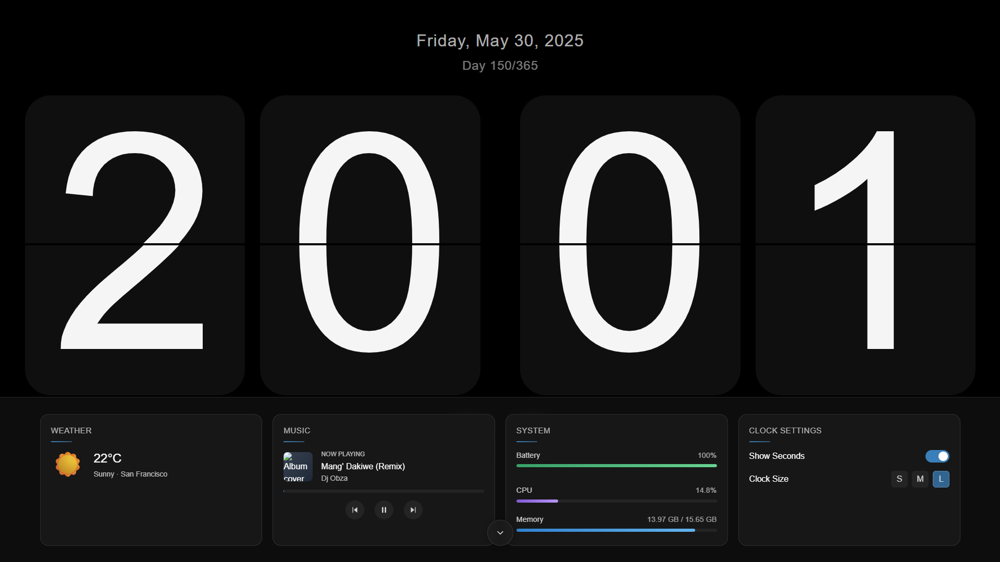

# ClockScape



ClockScape is a beautiful FLiqlo-inspired flip clock screensaver application built with Tauri, React, and TypeScript. It offers a sleek, customizable flip clock display that fills your screen with an elegant time display.

## Features

- **Realistic Flip Animation**: Smooth card-flip animation similar to the popular FLiqlo screensaver
- **Full-Screen Clock**: Beautiful time display that fills your screen
- **Customization Options**:
  - Adjustable clock size
  - Toggle seconds display
  - Date display
  - System information widgets
  - Music player controls
- **System Integration**:
  - Battery status monitoring
  - CPU/RAM usage statistics
  - Music player integration

## Usage

### Basic Controls

- **ESC**: Toggle the widgets panel
- **Size Options**: Choose between Small, Medium, and Fullscreen modes
- **Widget Toggle**: Access system information and controls

## Development

This project is built using:

- [Tauri](https://tauri.app/) - For creating lightweight desktop applications
- [React](https://reactjs.org/) - UI framework
- [TypeScript](https://www.typescriptlang.org/) - Type-safe JavaScript
- [Tailwind CSS](https://tailwindcss.com/) - Utility-first CSS framework

### Getting Started

1. Clone the repository:

   ```bash
   git clone https://github.com/yourusername/clockscape.git
   cd clockscape
   ```

2. Install dependencies:

   ```bash
   npm install
   ```

3. Run the development server:

   ```bash
   npm run tauri dev
   ```

4. Build for production:
   ```bash
   npm run tauri build
   ```

## System Requirements

- Windows 10/11, macOS 10.15+, or Linux
- 64-bit architecture

## Acknowledgements

- Inspired by the [FLiqlo Clock Screensaver](https://fliqlo.com/)
- Built with [Tauri](https://tauri.app/)

## License

This project is licensed under the [MIT License](./LICENSE).
